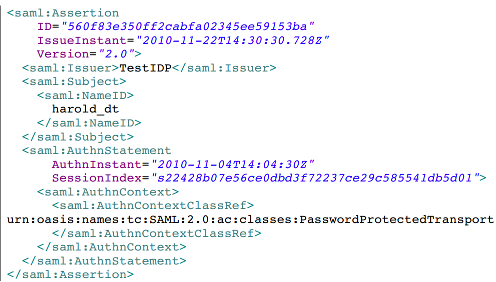
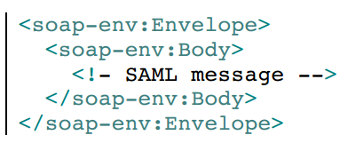
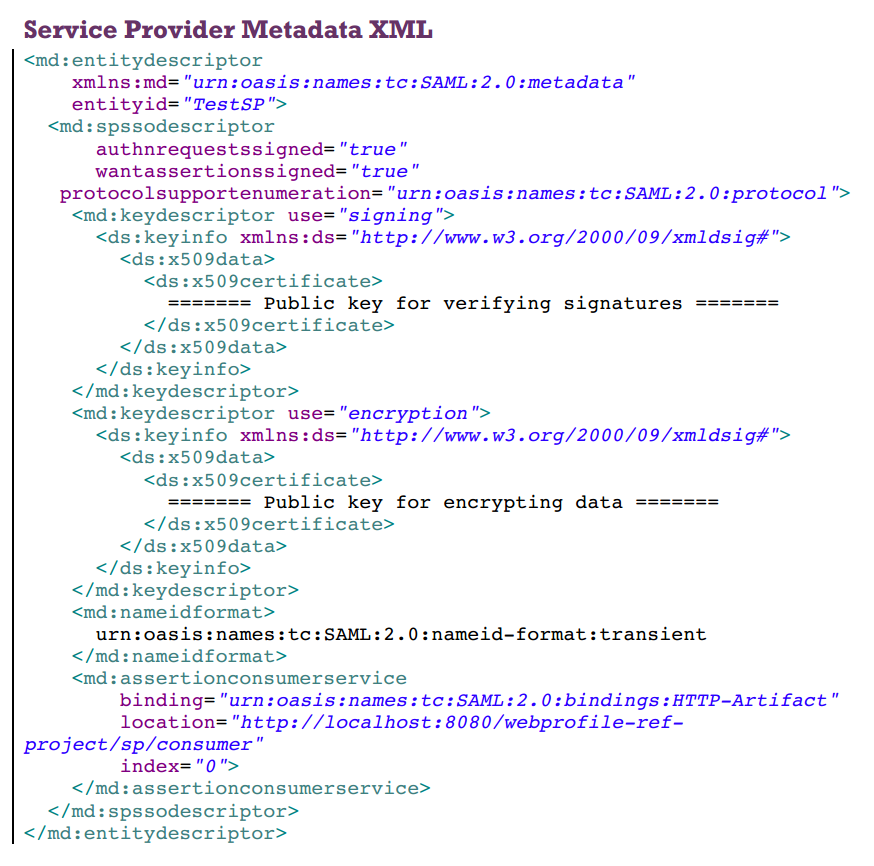
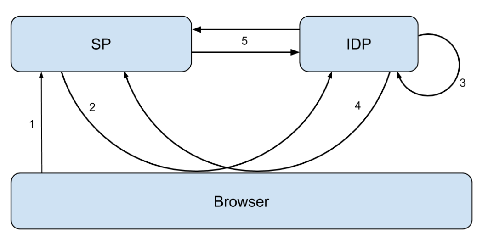

# OpenSaml Guide I : 简介
@(统一身份认证)[saml, 统一身份认证] 

##What's OpenSAML

OpenSAML是一个便于使用SAML消息的依赖库，其提供的主要功能包括：
1.  创建SAML消息；
2.  解析SAML对象并导出为XML格式；
3.  签名和加密；
4.  对SAML消息进行编码并传输。

目前*OpenSAML*库提供Java和C++实现的版本，需要注意的是OpenSAML虽然多应用用于*SSO*（单点登录）的开发中，但是该库本身不提供任何身份识别和授权的功能，其只是实现对于SAML消息的相关操作而已。

## SAML
SAML是一种XML框架用来交换安全信息，其中定义了按照安全规范所需要的通信的协议和格式。

SAML是一种中心化的认证机制，其定义了两种实体相互通信：

 - Service Provider(SP): 向用户提供正式商业服务的实体，通常需要认证一个用户的身份；
 - Identity Provider(IDP): 提供用户的身份鉴别，确保用户是其所声明的身份；

SAML的重要用途：
- 单点登录（SSO Single Sign-ON）；
- 联合认证（Federated Identity）；
- 在其他架构内使用SAML断言传输消息，比如[WS-Security（web services Security）](https://www.ibm.com/developerworks/cn/webservices/ws-secure/)

## SAML相关定义

### 1. 断言(Assertions) 即信息
断言是在SAML中用来描述**认证**的对象，其中包括一个用户在什么时间、以什么方式被认证，同时还可以包括一些扩展信息，比如用户的Email地址和电话等等。

下面便是一个断言的实例：


### 2. 协议（Protocol）即通信

协议规定如何执行不同的**行为**。这些行为被细化成一些列的Request和Response对象，而在这些请求和相应的对象中包含了**行为**所特别需要的信息。比如，认证请求协议（AuthnRequest Protocol）就规定了一个SP如何请求去获得一个被认证的与用户。
```
<saml2p:AuthnRequest
	AssertionConsumerServiceURL=http://localhost:8080/webprofile-refproject/sp/consumer
	Destination="http://localhost:8080/webprofile-refproject/idp/singleSignOnService"
	ID="_52c9839568ff2e5a10456dfefaad0555"
	IssueInstant="2014-05-13T17:34:37.810Z"
	ProtocolBinding="urn:oasis:names:tc:SAML:2.0:bindings:HTTPArtifact"
	Version="2.0">
	<saml2:Issuer>
		TestSP
	</saml2:Issuer>
	<saml2p:NameID
		PolicyAllowCreate="true"
		Format="urn:oasis:names:tc:SAML:2.0:nameid-format:transient"/>
	<saml2p:RequestedAuthnContext Comparison="minimum">
		<saml2:AuthnContextClassRef>
			urn:oasis:names:tc:SAML:2.0:ac:classes:Password
		</saml2:AuthnContextClassRef>
	</saml2p:RequestedAuthnContext>
</saml2p:AuthnRequest>
```
### 3. 绑定（Binding）即传输
绑定定义了SAML信息如何使用低级别的通信协议被传输。比如，HTTP重定向绑定，即声明SAML信息将通过HTTP重定向消息传输；再比如SAML SOAP绑定，声明了通过SOAP来传递SAML消息。


### 配置（Profiles） 即综合
配置定义了如何组织以上信息，并且在一个更高的层次上描述断言，协议和绑定如何被使用去解决一个具体情况。比如Web浏览器的SSO配置就描述了如何一个用户使用浏览器被认证。

### 元数据（MetaData）
SAML的元数据是配置数据，其包含关于SAML通信各方的信息，比如通信另一方的ID、Web Service的IP地址、所支持的绑定类型以及通信中实用的密钥等等。



>OpenSaml中提供了metadata provider来帮助构建和解读元数据。

## SAML Web浏览器 SSO配置
通过HTTP人工绑定来实现SSO：

#### 1. 用户尝试获得权限
流程首先从一个非认证的用户开始，该用户尝试从一个受保护的SP那里获得访问权限。某种格式的过滤器（filter）被设置在访问路径上来检测用户是否被授权。这一部分其实并不是SAML协议里的内容，但是却决定了是否要被授权。
#### 2. 用户被重定向到IDP
当访问路径上被设置的过滤器发现用户并非是被认证的，将会自动把用户从定向到IDP，以求验证用户的身份。
#### 3. 用户被认证
在这一步里，用户被认证。注意这里并没任何涉及到SP的交互，IDP对于以安全方式认证用户的结果有着全责。
#### 4. 已认证的用户被从定向回SP
当用户被认证成功之后，用户会携带着SAML制品（SAML artifact）被从定向回SP。这样的SAML制品也可以说是认证信息的**标识**，因为认证信息中有敏感的信息不能直接通过浏览器传输，所以这里只是发送标识而已。
#### 5. 要求认证信息
当收到SAML制品之后，SP将其发送回IDP，IDP依据SAML制品找到认证信息，并通过**SAML制品响应**发送回SP

上面提到的SAML制品响应中就包含SAML断言，它就是认证的证据。断言中最重要的数据就该用户什么时候以什么方式被认证的。

## OpenSAML 快速上手
说了这么多理论上的流程，现在开始讲讲OpenSAML这个库的构成和使用。

###如何添加OpenSAML库
OpenSAML库可以在OpenSAML的主页中获得，对于Maven用户可以直接在如下链接中获得依赖：
https://build.shibboleth.net/nexus/content/repositories/releases/org/opensaml/
OpenSAML3是由Maven组织的多模块库，每个模块的功能各不相同。由于项目功能越来越丰富，对于现在的用户已经不可能通过一个单一的依赖来引用其所有的功能了。每个模块都需要添加自己都得引用。OpenSAML最新版的模块列表如下：
>• opensaml-core
• opensaml-profile-api
• opensaml-profile-impl
• opensaml-soap-api
• opensaml-soap-impl
• opensaml-saml-api
• opensaml-saml-impl
• opensaml-xacml-api
• opensaml-xacml-impl
• opensaml-xacml-saml-api
• opensaml-xacml-saml-impl
• opensaml-messaging-api
• opensaml-messaging-impl
• opensaml-storage-api
• opensaml-storage-impl
• opensaml-security-api
• opensaml-security-impl
• opensaml-xmlsec-api
• opensaml-xmlsec-impl

用户可以根据自己项目的情况自行添加需要的模块，Maven中具体引用的信息如下：

```
<dependencies>
	<dependency>
		<groupId>org.opensaml</groupId>
		<artifactId>opensaml-core</artifactId>
		<version>3.2.0</version>
	</dependency>
	<dependency>
		<groupId>org.opensaml</groupId>
		<artifactId>opensaml-saml-api</artifactId>
		<version>3.2.0</version>
	</dependency>
	<dependency>
		<groupId>org.opensaml</groupId>
		<artifactId>opensaml-saml-impl</artifactId>
		<version>3.2.0</version>
	</dependency>
	<dependency>
		<groupId>org.opensaml</groupId>
		<artifactId>opensaml-messaging-api</artifactId>
		<version>3.2.0</version>
	</dependency>
	<dependency>
		<groupId>org.opensaml</groupId>
		<artifactId>opensaml-messaging-impl</artifactId>
		<version>3.2.0</version>
	</dependency>
	<dependency>
		<groupId>org.opensaml</groupId>
		<artifactId>opensaml-soap-api</artifactId>
		<version>3.2.0</version>
	</dependency>
	<dependency>
		<groupId>org.opensaml</groupId>
		<artifactId>opensaml-soap-impl</artifactId>
		<version>3.2.0</version>
	</dependency>
</dependencies>
<repositories>
	<repository>
		<id>Shibboleth repo</id>
		<url>
		https://build.shibboleth.net/nexus/content/repositories/releases
		</url>
	</repository>
</repositories>
```
###保证JCE实现的正确性

OpenSAML使用JCE来提供密码学的功能模块。由于某些
JCE的实现并不覆盖所有OpenSAML要求的功能，所以推荐使用**Bouncy Castle**的JCE实现。

为了帮助用户来确认JCE的实现是否正确，可以使用如下函数：

```
JavaCryptoValidationInitializer javaCryptoValidationInitializer = 
	new JavaCryptoValidationInitializer();
javaCryptoValidationInitializer.init();
```
这个方法应该在OpenSAML初始化之前被调用，来确保当前的环境可以符合要求，可以提供必要的算法——*AES/CBC/ISO10126Padding*。
>***AES/CBC/ISO10126Padding***
>对于XML的加密，JCE需要支持ACE（128/256），并使用ISO10126Padding（填充位），但是很可惜，大部分JCE并没有实现该填充算法。
>ISO10126Padding：不满8位会填充至8位，填充数最后一个Byte表示填充位数，其他填充位是随机数


如下方法可以用来打印当前已经被安装的所有JCE的provider:

```
for (Provider jceProvider : Security.getProviders()) {
	logger.info(jceProvider.getInfo());
}
```
使用Maven引用OpenSAML时，Bouncy Castle
provider将会被自动引用。如果是手动下载OpenSAML源码依赖，其中也已经包括了Bouncy Castle provider，但是需要手动添加到class path中。

### 日志打印
OpenSAML使用**SLF4J**管理日志信息。虽然SLF4J本身没有任何打印日志的能力，但是其依赖于其他logging的实现来做日志管理。OpenSAML团队选择使用**Logback**来实现logging功能（其他的实现也可以）。

为了能使用LogBack，需要添加依赖包:
- logback-core
- logback-classic 
- apache commons logging

其下载链接如下：
http://logback.qos.ch/download.html,
https://commons.apache.org/proper/commons-logging/

或者直接添加Maven依赖：

```
<dependency>
	<groupId>ch.qos.logback</groupId>
	<artifactId>logback-core</artifactId>
	<version>1.0.13</version>
</dependency>
<dependency>
	<groupId>ch.qos.logback</groupId>
	<artifactId>logback-classic</artifactId>
	<version>1.0.13</version>
</dependency>
<dependency>
	<groupId>ch.qos.logback</groupId>
	<artifactId>logback-classic</artifactId>
	<version>1.0.13</version>
</dependency>
<dependency>
	<groupId>commons-logging</groupId>
	<artifactId>commons-logging</artifactId>
	<version>1.2</version>
</dependency>
```

### OpenSAML初始化过程
OpenSAML的初始化依赖于一些列配置文件。OpenSAML已经有一个默认的配置，其已经可以满足大多数的使用需求，如果有需要还可以对其修改。

配置文件必须在OpenSAML使用之前被加载，加载默认配置需的方法如下进行：

```
InitializationService.initialize();
```
这之后，OpenSAML库才能正常使用；

>如果不加载配置文件，OpenSAML的初始化将不能完成，其无法返回某个Obejct，返回*NullPointerException*。这是一个常见的错误。

#### 创建SAML对象
SAML对象的创建使用了工厂模式和构建者模式，涉及到链式配置和类型准换。

创建SAML断言对象的方法如下：

```
XMLObjectBuilderFactory builderFactory =
	XMLObjectProviderRegistrySupport.getBuilderFactory();
Assertion assertion = (Assertion) builderFactory
	.getBuilder(Assertion.DEFAULT_ELEMENT_NAME)
	.buildObject(Assertion.DEFAULT_ELEMENT_NAME);
```
为了避免大量不需要的代码，使用泛型的工具方法是一个好主意。可以通过如下方法生成不同类型的对象：

```
public static <T> T buildSAMLObject(final Class<T> clazz) {
	XMLObjectBuilderFactory builderFactory =
		XMLObjectProviderRegistrySupport.getBuilderFactory();
	QName defaultElementName = (QName) clazz.getDeclaredField(
	"DEFAULT_ELEMENT_NAME").get(null);
	T object = (T) builderFactory.getBuilder(defaultElementName)
		.buildObject(defaultElementName);
	return object;
}
```
通过使用上面的方法，就可以将生成断言对象的代码简化为一行；

```
OpenSAMLUtils.buildSAMLObject(Assertion.class);
```

#### 实例项目
为了方便读者理解和后续文章的解读，这里提供一个示例项目：一个很简单的网址，其充当SP；同时该项目还包括一个很简单的IDP；
SAML协议的交互将在这二者之间展开。

项目地址：
https://github.com/sunrongxin7666/OpenSAML-ref-project-demo-v3.git

这个项目基于Bitbucket的一个实验项目https://bitbucket.org/srasmusson/webprofile-ref-project-v3
其本身是使用Apache Maveng构建的，启动项目需要执行

```
mvn tomcat:run
```
嵌入项目中的Tomcat就会启动，运行成功时会有如下信息：
>INFO: Starting Coyote HTTP/1.1 on http-8080

经过本人的修改，该项目可以在**IntelliJ Idea**以工程模式打开，运行方式设置为mvn，命令是tomcat:run。这就便于读者调试和修改。


项目启动之后，访问如下网址：
http://localhost:8080/webprofile-ref-project/app/appservlet
这是一个SP的模拟，第一次访问该网址时将会跳转到IDP，进行认证流程。


点击“Authenticate”按钮将通过认证，并重定向回SP,


到此为止整个SAML协议的流程及完成了，相关日志信息会在控制台中输出。


